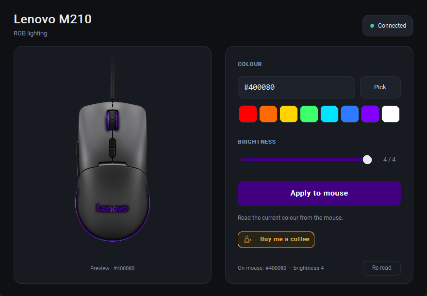

# Lenovo M210 RGB control

Set a custom static RGB colour on the **Lenovo M210 RGB Gaming Mouse** (USB `17EF:6187`) from Windows.

Lenovo ships no software for this mouse. The only documented way to change its lighting is
pressing **Back + middle-click** to cycle seven preset effects and off. No general-purpose tool
recognises it either — OpenRGB, libratbag/Piper, Polychromatic and OpenRazer all fail to detect
the device. This project talks to it directly.



## Download

Grab **`M210-RGB.exe`** from the [latest release](https://github.com/senthamizhanR/lenovo-m210-rgb-control/releases/latest) and run it. Single portable executable, ~21 MB, no installer and no
Python required. Plug the mouse in by USB and the app finds it.

## What it does

- Any 24-bit colour, by hex value, colour picker, or one of eight presets
- Brightness, 0–4
- Live preview before you apply anything
- Reads the colour currently stored on the mouse at launch
- Every write is verified by reading the value back

The colour is stored in the mouse's own memory, so it survives reboots and persists on other
machines. Pressing the hardware **Back + middle-click** combo replaces it with the next built-in
preset, exactly as it always did.

## What it deliberately does not do

Two capabilities were tested on real hardware, found harmful, and are excluded by construction —
not merely unused:

**Per-LED / direct mode (`0x12`, `0x13`).** The firmware acknowledges these with status `0x00`
and then discards the payload; the LEDs never take the supplied colours. The only observable
effects are the lighting engine glitching and, worse, the firmware emitting a malformed mouse
report that latches buttons 3/4/5 down system-wide. That latch lives in Windows' input state, not
the device, so unplugging does not clear it. `m210_device.py` enforces a command whitelist that
rejects these opcodes.

**Profile bytes 9–18.** This region is the button-function map, not lighting. Writing zeros there
latched the middle and both side buttons. The writer is capped at the 9-byte lighting prefix, so
no offset past byte 8 can be reached.

If you are reverse-engineering this device yourself, those are the two traps.

## Protocol

EVision V2 transport over the vendor HID collection `FF1C:0092` — report ID `0x04`, 64-byte
reports, additive checksum over bytes 3–63 stored little-endian in bytes 1–2. The MCU is a Sonix
SN32F part; EVision is one of two companies rebranding that family.

The active profile is 64 bytes at offset `0x0001`. Its first nine bytes are the lighting prefix:

| Byte | Meaning |
|---|---|
| 0 | Mode — `0x00` rainbow, `0x01` static, `0x02` palette fade-cycle |
| 1 | Brightness, 0–4 |
| 2 | Speed |
| 3 | Direction |
| 4 | Always `0xFF`; meaning unknown, left untouched |
| 5–7 | Red, green, blue |
| 8 | Built-in slot |

Note that mode `0x00` is the **rainbow**, not "off", despite being the eighth state in the
hardware cycle.

Bytes 19–63 hold five 9-byte blocks at stride 9. The first three bytes of each are an RGB triplet,
and in the factory profile those five are exactly the colours the hardware cycle steps through, in
order: blue, green, amber, orange, red. Mode `0x02` fades between them. The remaining six bytes of
each block appear to be the five DPI stages (600–7800).

Writes go through `WRITE_CONFIG` (`0x06`) wrapped in `BEGIN_CONFIGURE` / `END_CONFIGURE`
(`0x01`/`0x02`). That is the persistent path, so it is not suitable for driving animation.

## Build from source

```powershell
python -m venv .venv
.venv\Scripts\python -m pip install -r requirements.txt
.venv\Scripts\python -m PyInstaller --noconfirm --clean --onefile --windowed ^
  --name "M210-RGB" --icon icon.ico ^
  --add-data ".venv/Lib/site-packages/customtkinter;customtkinter" ^
  --add-data "icon.ico;." --add-data "mouse.png;." main.py
```

Build in a clean virtual environment, not a full Anaconda install — PyInstaller will otherwise
sweep in the entire MKL/NumPy stack and the executable balloons from 21 MB to 238 MB.

`hidapi` is the compiled binding and bundles the native library. The pure-Python `hid` package
looks similar but needs `hidapi.dll` present separately, and will not work here.

## Layout

| File | Role |
|---|---|
| `main.py` | The GUI |
| `m210_device.py` | HID protocol, static colour only, command whitelist |
| `photo_render.py` | Tints the lit zones of the product photo to the chosen colour |
| `mouse_render.py` | Drawn fallback preview when no photo is present |
| `make_icon.py` | Generates `icon.ico` from the drawn renderer |

The preview separates lit zones from the shell by saturation — the shell measures 4–10 and the
cable peaks at 23, while the wheel, logo and base arc run 120–160. Lit pixels are re-tinted as
`target × (brightness/255)`, preserving the original falloff so the result still reads as a
photograph rather than a flat fill.

## Support

If this saved you some trouble, you can [buy me a coffee](https://www.paypal.me/rsenthamizhan).
There is a button for it in the app too. Entirely optional — the project is MIT licensed and stays
that way.

## Disclaimer

Not affiliated with, endorsed by, or supported by Lenovo. The protocol was reverse-engineered
from a single device; it may behave differently on other units or firmware revisions. Use at your
own risk.

`mouse.png` is Lenovo product imagery, included for illustration only, and remains the property of
Lenovo. The app runs without it — `mouse_render.py` draws an original illustration as a fallback.

## Licence

MIT. See [LICENSE](LICENSE).
